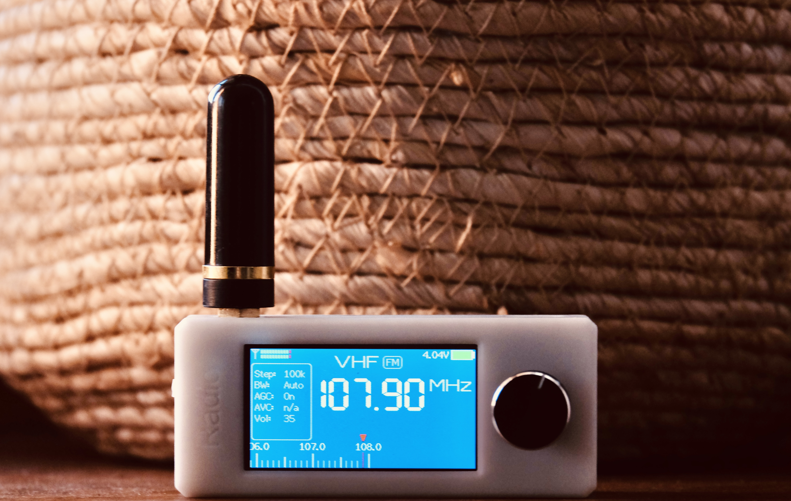

# ATS-Mini SI4732 ESP32-S3 Receiver (Enhanced Edition)

> **Branch:** ATSMini  
> **Target Hardware:** ESP32-S3 OSPI / QSPI + Silicon Labs SI4732 Receiver + 1.14" ST7789 IPS Display + Rotary Encoder

## Key Enhancements in This Version

1. **Full-Fledged Web Remote SPA (WebRemote.h):**
   - **SoftAP Fallback:** Automatically creates open Wi-Fi network ATS-Mini-Remote at 192.168.4.1 if not connected to local Wi-Fi.
   - **Wi-Fi Manager:** Scan and connect to local 2.4 GHz Wi-Fi directly from the Web Remote.
   - **Complete Radio Controls:** Direct frequency entry, step tune buttons, fine BFO tune slider for SSB, all 28 bands selector, AM/FM/USB/LSB mode toggle, volume slider, audio mute toggle, squelch slider, AGC/Attenuator switch.
   - **Telemetry:** Real-time signal strength (dBµV), SNR (dB), and battery voltage indicator.
   - **Memory Channels:** Load, save, and tune 99 customizable memory slots.

2. **Top Taskbar Local IP Display:**
   - Displays current local IP address on the physical ST7789 display top taskbar (before the Wi-Fi icon) whenever connected to Wi-Fi or active in AP mode.

3. **Instant 2.5-Second Hold-to-Cancel Navigation:**
   - Holding down the rotary dial knob for 2.5 seconds triggers an immediate Back/Cancel action without requiring knob release.

4. **Thread-Safe Seek Engine:**
   - Asynchronous seek request dispatching from web server to Core 1 main loop, preventing FreeRTOS task watchdog timeouts and SPI display bus collisions.
   - Automatic band-limit clamping when reaching band boundaries (BLTF) on MW/SW bands.

5. **GMT+5:30 (IST) Time Support & Browser Sync:**
   - Default timezone set to UTC+5:30 (IST).
   - Automatic time and timezone synchronization from connected browser or phone upon opening the Web Remote.

6. **Aviation / ATC Reception:**
   - Supports HF Oceanic Air Traffic Control (MWARA) and international aviation weather (VOLMET) across 2.8 MHz - 22 MHz in USB mode.

---

# ATS Mini

This firmware is for use on the SI4732 (ESP32-S3) Mini/Pocket Receiver

Based on the following sources:

* Volos Projects:    https://github.com/VolosR/TEmbedFMRadio
* PU2CLR, Ricardo:   https://github.com/pu2clr/SI4735
* Ralph Xavier:      https://github.com/ralphxavier/SI4735
* Goshante:          https://github.com/goshante/ats20_ats_ex
* G8PTN, Dave:       https://github.com/G8PTN/ATS_MINI

## Releases

Check out the [Releases](https://github.com/esp32-si4732/ats-mini/releases) page.

## Documentation

The hardware, software and flashing documentation is available at <https://esp32-si4732.github.io/ats-mini/>

## Discuss

* [GitHub Discussions](https://github.com/esp32-si4732/ats-mini/discussions) - the best place for feature requests, observations, sharing, etc.
* [TalkRadio Telegram Chat](https://t.me/talkradio/174172) - informal space to chat in Russian and English.
